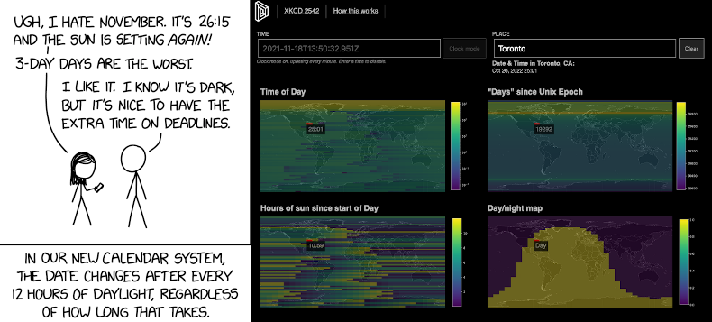

# Daylight maps (XKCD 2542)

&#xa9; Randall Monroe, 2021

Daylight calendar, where every 12 hours of sun gives you a freshly minted day! These are maps showing the whole world how the whole world experiences the calamity of variable day lengths, with arbitrary date and location entry and a "clock mode" that updates slowly over the course of the day to put on your smart-fridge or something.

**Try it out on [day.lam.io](https://day.lam.io)**

Sunrise/sunset lookup tables were made with [`astral`](https://github.com/sffjunkie/astral/) which itself uses [a calculator published by NOAA](https://gml.noaa.gov/grad/solcalc/calcdetails.html) by Jean Meeus. On the live site, 60 years of data are precalculated starting at the Unix Epoch (Jan 1 1970, 00:00:00 UTC) and optimized for fast query in Postgres. Relevant queries include:

- True time since last "tick" of the 12-hour sunlight day
- Hours of sunlight since the last "tick"
- Days since the epoch
- Variation with longitude

The exact definition of "sunrise" and "sundown" are the biggest source of error in these calculations. `astral` accounts for atmospheric refraction and is purely geometric, calculating when the sun itself disappears below a featureless horizon. The calculator by NOAA states that times are accurate to within 1 minute for non-polar latitudes. Meanwhile, this app assumes that the sunrise/sunset times are perfect and queries `astral` for the entire 60 years worth of data without trying to exploit any symmetries and such, assuming the worst for orbital nonidealities. The datetimes and deltas are carefully managed so that the integration error shouldn't be more than a few seconds over this period of time.

A time system with a yearly epoch (i.e. all times resynced every Jan 1 00:00 UTC) is also calculated under `year_cumsum`.

To install:

1. Push the schemas into postgres: `psql x2542 < schemas.sql`;
1. Generate table of sunrise/sunset times across latitudes in `proc/generate.py`;
1. Postprocess and generate final lookup tables in Postgres: `psql x2542 < postprocess.sql`
1. Build the `places` table according to [acrylic-origami/reaction-maps](https://github.com/acrylic-origami/reaction-maps/)
1. Create credentials file for server: `echo 'creds = "user=<pg user> password=<pg pass>"' > x2542/creds.py`
1. Start up flask dev server: `FLASK_APP=x2542/server.py FLASK_ENV=development flask run`
1. Hit at `localhost:5000/static/index.html`
1. Deploy to Apache + mod_wsgi by:
	- Specifying the missing paths in `x2542.conf` and moving it to `sites-enabled`
	- Installing the server into the environment via `pip install .`
	- Hitting the Apache server